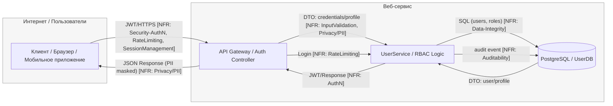

# S04 - DFD

Этот файл - **шаблон минимальной DFD** для семинара S04.
Скопируйте и ведите у себя в репозитории в: `SEMINARS/S04/S04_dfd.md`.

**Задача:** за 15-20 минут построить **понятную DFD** уровня сервиса (3-5 узлов) с явными **границами доверия** и подписями ключевых **потоков данных**. Эту DFD вы далее используете в `S04_stride_matrix_template.md` для STRIDE per element и приоритизации **L×I (1-5)**.

---

## Правила минимальной DFD

* **3-5 узлов** максимум: *Клиент/Front*, *API/Controller*, *Service/Бизнес-логика*, *DB/Хранилище*, *(опционально)* *External API/Queue*.
* Явно отметьте **trust boundaries** (Интернет ↔ Сервис, Сервис ↔ Внешние системы, Сервис ↔ Хранилище).
* На **рёбрах** подпишите **типы данных**: `JWT`, `PII`, `file`, `payment`, `DTO`, `SQL`, `event`, …
* Не уходим в микросервисы и детали реализации - уровень **контур/сервис**.
* Сразу держите связь с S03: около потока/узла можно указать **`[NFR: …]`** (ID из реестра S03).

---

## Базовый каркас (mermaid)

---

## Описание элементов DFD

### Узлы (Nodes)

| Узел | Описание | Trust Boundary |
|------|----------|----------------|
| **U (Клиент/Браузер/Мобильное приложение)** | Пользовательское приложение | Internet |
| **A (API Gateway/Controller)** | Точка входа, валидация, аутентификация | Service |
| **S (User service)** | Основная бизнес-логика | Service |
| **D (PostgreSQL/UserDB)** | Хранение данных | Service |

### Потоки данных (Data Flows)

| Поток | Тип данных | NFR связи | Описание |
|-------|------------|-----------|----------|
| **U → A** | JWT/HTTPS | NFR-003 (AuthN) | Аутентификация пользователя |
| **U → A** | PII/Profile Data | NFR-001(Privacy/PII) | Персональные данные |
| **A → S** | DTO/Requests | NFR-007 (InputValidation) | Валидированные запросы |
| **A → S** | Rate Limited | NFR-006 (RateLimiting) | Ограничение скорости |
| **S → D** | SQL/ORM | NFR-004 (Data-Integrity) | Безопасные запросы к БД |
| **S → D** | Audit Events | NFR-005(Auditability) | События аудита |

---

## Trust Boundaries (Границы доверия)

### 1. Internet ↔ Service
- **Клиент** (недоверенная среда) ↔ **API Gateway** (доверенная среда)
- **Контроли**: HTTPS, JWT валидация, Rate Limiting, Input Validation

### 2. Service ↔ External
- **Сервис** (доверенная среда) ↔ **Внешние API** (частично доверенные)
- **Контроли**: Timeouts, Retry, Circuit Breaker, Audit Logging

### 3. Service ↔ Database
- **Сервис** (доверенная среда) ↔ **База данных** (доверенная среда)
- **Контроли**: Параметризация SQL, Транзакции, Audit Events

---

## Связь с NFR из S03

| NFR ID | Категория | Применение в DFD |
|--------|-----------|------------------|
| **NFR-001** | Privacy/PII | A → S (маскирование PII) |
| **NFR-003** | Security-AuthN | U → A (авторизация) |
| **NFR-004** | Data-Integrity | S → D (SQL параметризация) |
| **NFR-005** | Auditability | S → D(аудит событий) |

---

## Готовность к STRIDE анализу

 **3-5 узлов**: Клиент, API, Сервис, БД, Внешние API
 **Trust boundaries**: Чётко обозначены границы доверия
 **Потоки данных**: Подписаны типы данных и NFR связи
 **NFR связи**: Каждый поток связан с требованиями из S03

**Следующий шаг**: Переход к `S04_stride_matrix.md` для STRIDE per element анализа.
